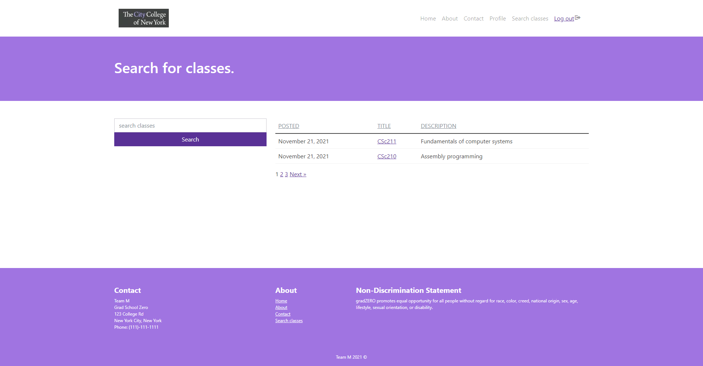
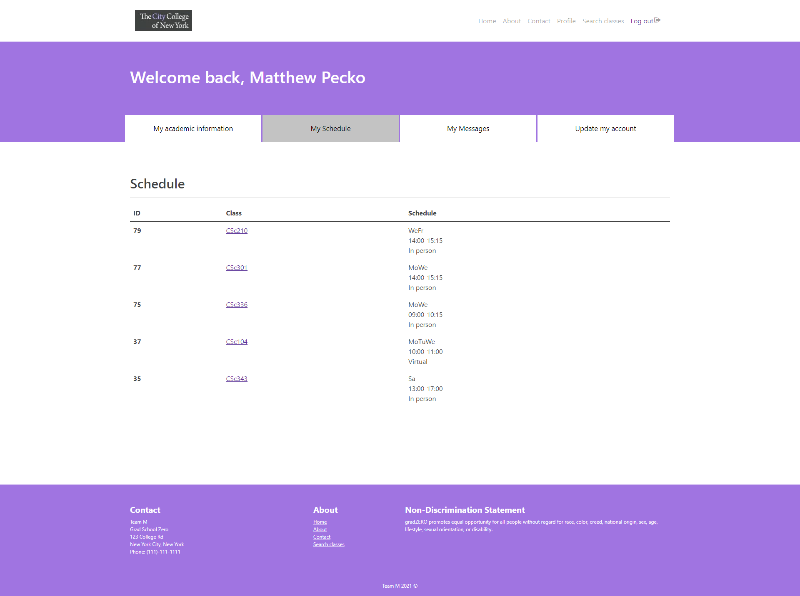
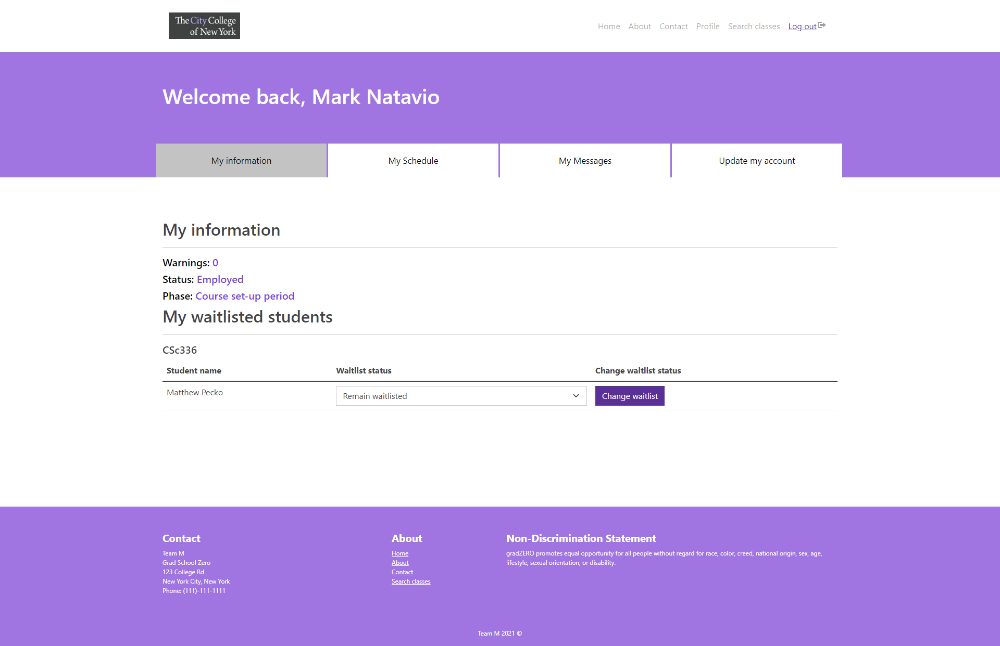
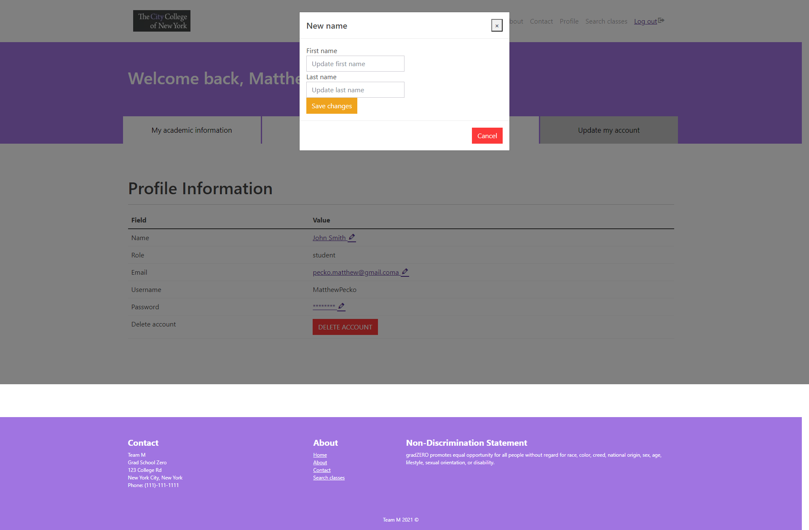
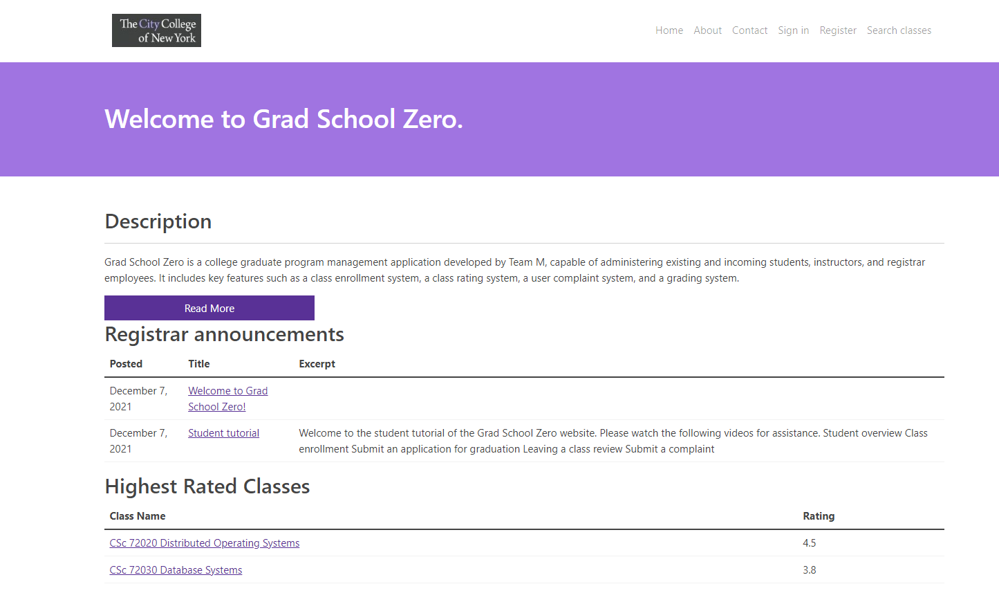
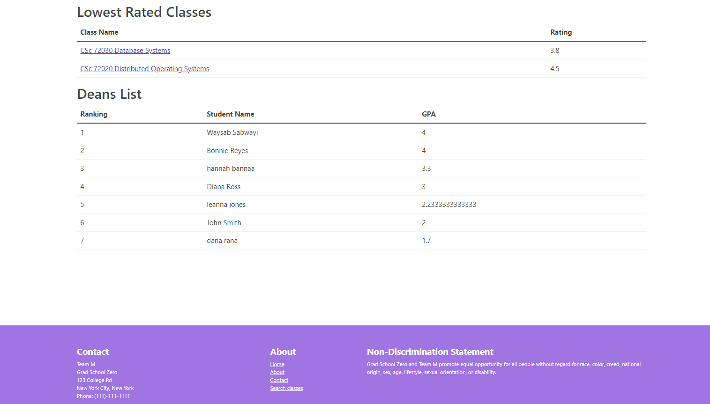

# GSZTheme

Grad School Zero is a college graduate program management application developed by Team M, capable of administering existing and incoming students, instructors, and registrar employees. It includes key features such as a class enrollment system, a class rating system, a user complaint system, and a grading system.

This is a graduate school Wordpress Theme for the Grad School Zero website.

## **Usage**

**Live Demo:** [Grad School Zero](http://52.168.54.18/wordpress/) using Microsoft Azure

**Local Demo:**

1) Install XAMPP. Turn on your Apache and MySQL instances.
2) Download [Wordpress](https://wordpress.org/download/#download-install) on your Machine in `.../directory/xampp/htdocs`. Unzip it into that file and rename it as `gradSchoolZero`.
3) Move GSZTheme and [GSZPlugin](https://github.com/Matthew1172/GSZPlugin) into their respective folders in `.../xampp/htdocs/gradSchoolZero/wp-content`, which would be the `/themes` and `/plugins` directory
4) Upon accessing your `localhost`, click on `gradSchoolZero` as one of the indices.
5) Follow the instructions to installing Wordpress. As administor of WP, you'll land on the [Dashboard](http://localhost/gradSchoolZero/wp-admin)
   1) Go to the Appearance tab and select Grad School Zero as your theme.
   2) Go to the Plugins tab and select Grad School Zero as your plugin.
6) Upon accessing `localhost/gradSchoolZero`, you should have access to the website as administrator! Hooray!

## **Project Structure**

**assets** - holds stylization, javascript, pictures, and bootstrap framework for our frontend

**classes** - for object oriented needs of the frontend and bootstrap

**images** - images of the stars we use to add ratings and reviews of the students

**inc** - PHP functions for each page, all which are necessitated b/c of our spec sheet

**template-parts** - holds structure of our pages and what appears where depending on application state, including content of body, footer/header info, and profile structure

**all else** - the pages, which rely on the components of the other directories, rest on the root directory

## Infrastructure + Front-End

**WordPress** - framework which provides a graphical user interface and content management service

**Apache** - Served as our web server

**Azure** - For deployment on our production server

**PHP** - Scripting language

**JavaScript** - Makes web-based applications interactive

**HTML/CSS** - Used for stylization and text modification

**Bootstrap** - CSS Framework

### Why this stack?

Wordpress comes with a GUI which helped us interact with a database while providing great security measures. It is a good way to organize and view the frontend and backend versions of our website.  It allows for compatibity amongst websites, web apps + mobile apps and comes with a great and large community. As for the XAMPP tech stack, it is a simple and lightweight solution which works wonders for testing and locally hosting websites and clients on servers.

## External Links

[CSC 322 Report - Team M (FINAL)](https://discord.com/channels/880525643547283466/880525644075778172/918331802857381899)

[CSC 322 - Phase 2 Report](https://docs.google.com/document/d/1R1VgcX8y5uY24H5yis6-SqwnVhoiczTvohWB7uZnJHo/edit)

[UML Diagram](https://miro.com/app/board/o9J_luuvkTY=/?invite_link_id=526400883626)

[E-R Diagram](https://miro.com/app/board/uXjVOfGtL0w=/?invite_link_id=927914406783)

[Report 2 Diagram](https://miro.com/app/board/o9J_liRiAc4=/?invite_link_id=120245950550)

[Big Collaboration Class Diagram](https://miro.com/app/board/uXjVOfArji8=/?invite_link_id=972464468462)

## Sample Screenshots

